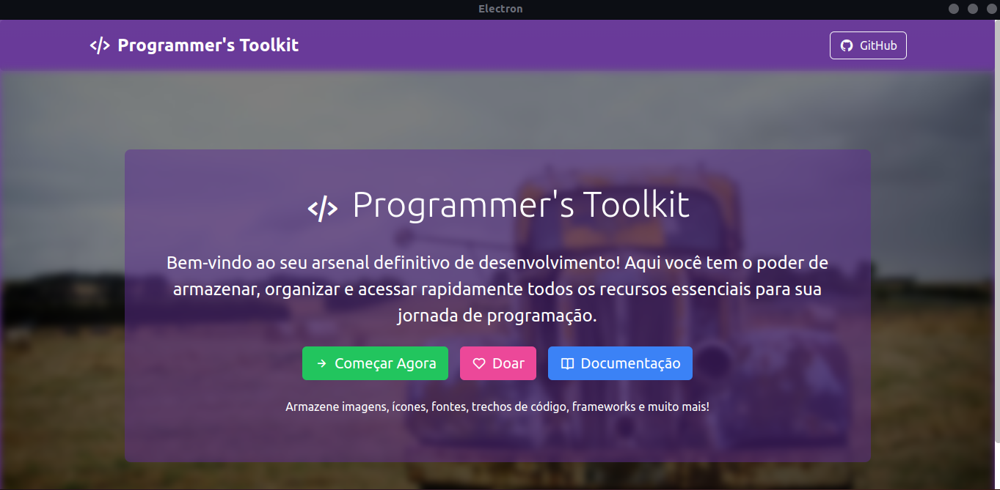
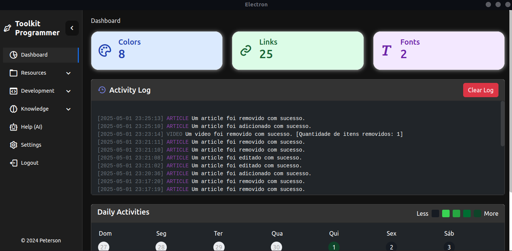
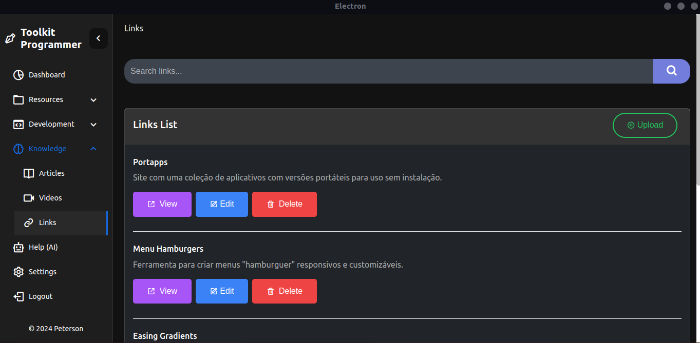

# 🛠️ Toolkit Programmer  

  

**Uma ferramenta tudo-em-um para desenvolvedores organizarem recursos e aumentarem produtividade**

---

## ✨ Recursos Principais  

- 🗃️ **Repositório Centralizado**  
  Armazene e organize:  
  - ✅ Imagens
  - ✅ Ícones 
  - ✅ Fontes  
  - ✅ Trechos de código 
  - ✅ Artigos técnicos
  - ✅ E muito mais...

- 🤖 **Assistente Multi-IA**  
  Integração com:  
  🔹 Deepseek
  🔹 Gemini
  🔹 Meta - LaMA
  🔹 NVIDIA - LaMA
  🔹 Qwen  

- 🔍 **Busca Inteligente**  
  Encontre qualquer recurso com tags e pesquisa full-text  

- 🌈 **Interface Customizável**  
  Tema claro/escuro e idiomas EN/PT/ES 

---

## 🚀 Comece Agora  

### 📥 Instalação  
```bash
git clone https://github.com/seu-user/toolkit-programmer.git
cd toolkit-programmer
npm install
```

### 🛠️ Comandos Úteis

```bash

npm run dev // Desenvolvimento
npm run build:win // Build para Windows
npm run build:mac // Build para macOS
npm run build:linux // Build para Linux

```
## 🎨 Screenshots

<div align="center">    </div>

## 📚 Como Contribuir

Quer ajudar a melhorar o Toolkit Programmer? Seguimos um processo simples:

### 📋 Passo a Passo para Contribuir

1. **Faça um Fork do Repositório**
   - Clique no botão "Fork" no canto superior direito [desta página](https://github.com/PetsuTHEPRO/toolkit-programmer)
   - Isso criará uma cópia do projeto na sua conta GitHub

2. **Clone o Seu Fork**
   ```bash
   git clone https://github.com/SEU-USUARIO/toolkit-programmer.git
   cd toolkit-programmer
   ```
3. **Configuração do Ambiente**

Primeiro, instale as dependências e inicie o ambiente de desenvolvimento:

```bash
npm install   # Instala todas as dependências
npm run dev   # Inicia o servidor de desenvolvimento
```
4. **Criando uma Nova Branch**

Crie uma branch específica para sua contribuição:

```bash
git checkout -b minha-contribuicao
```
5. **Fazendo as Alterações**

Fazendo suas Alterações
- Edite ou adicione arquivos no projeto
- Teste localmente suas mudanças
- Mantenha o código:
   - Bem organizado
   - Documentado
   - Testado
- Seguindo o padrão existente

6. **Commitando as Alterações**

```bash
git add .
git commit -m "Minha contribuição"
```
7. **Enviando as Alterações**

```bash
git push origin minha-contribuicao
```

## 🤝 Colaboradores

- [Peterson Menezes](https://github.com/petsuTHEPRO)

## 📝 Licenca

[MIT](https://choosealicense.com/licenses/mit/)

---